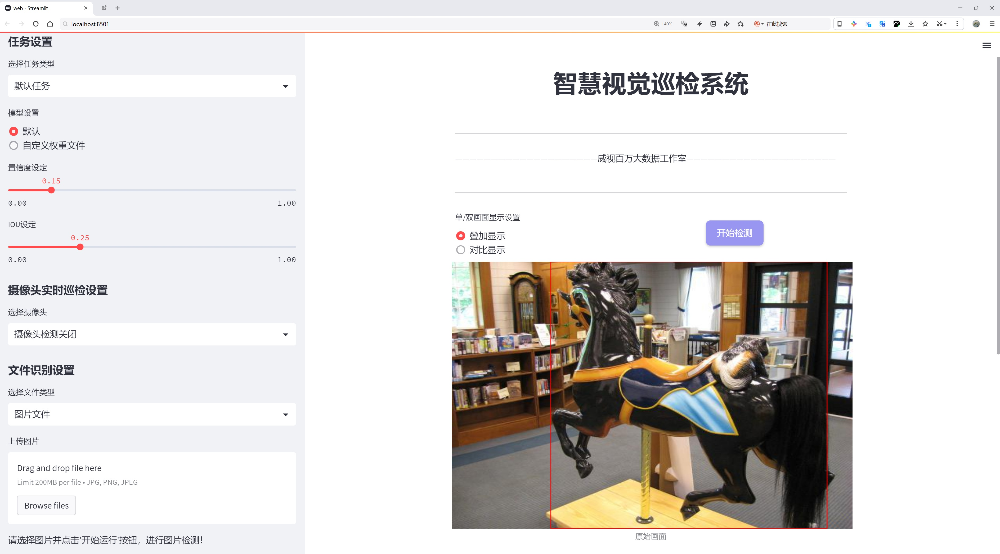
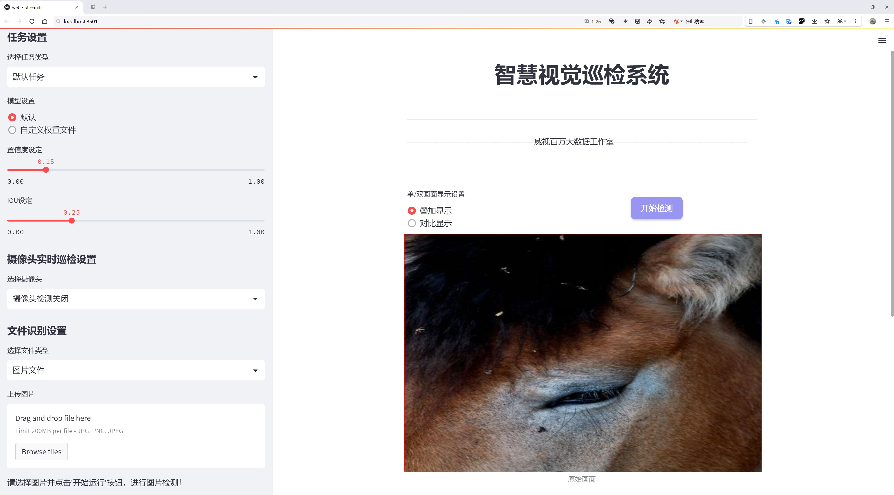
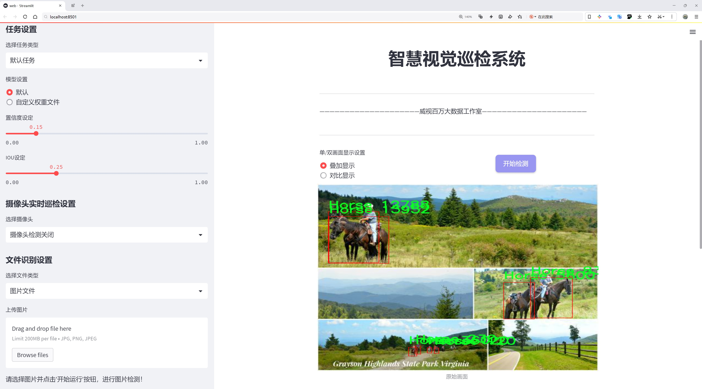
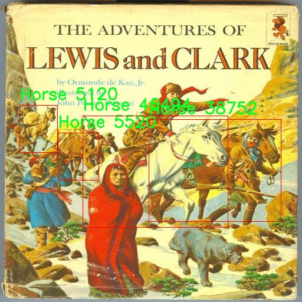
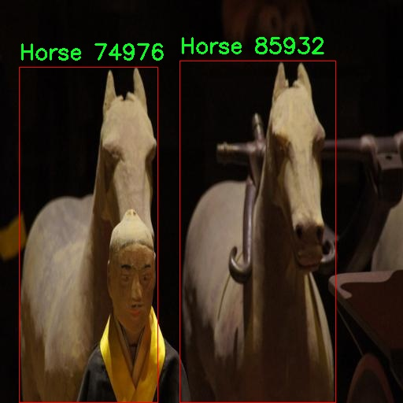
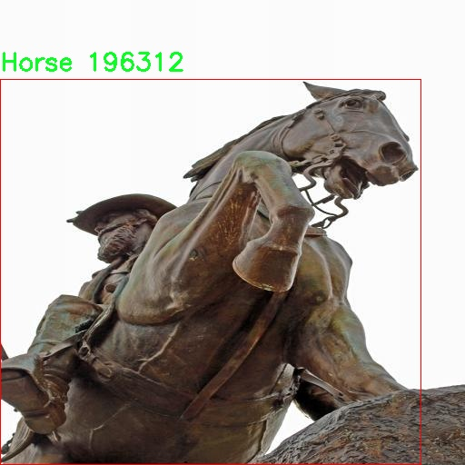
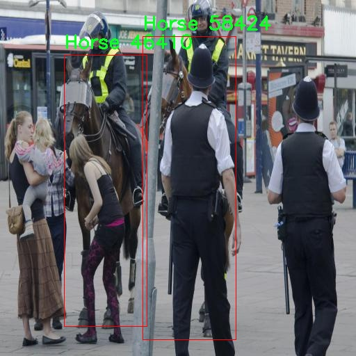
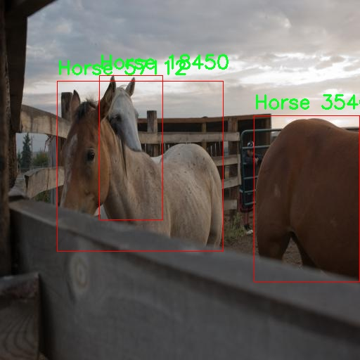

# 马匹行为识别检测系统源码分享
 # [一条龙教学YOLOV8标注好的数据集一键训练_70+全套改进创新点发刊_Web前端展示]

### 1.研究背景与意义

项目参考[AAAI Association for the Advancement of Artificial Intelligence](https://gitee.com/qunshansj/projects)

项目来源[AACV Association for the Advancement of Computer Vision](https://gitee.com/qunmasj/projects)

研究背景与意义

随着人工智能技术的迅猛发展，计算机视觉领域的应用逐渐深入到各个行业，尤其是在动物行为识别方面，已经成为一个重要的研究方向。马匹作为一种重要的经济动物，广泛应用于农业、体育、娱乐等多个领域，了解和分析马匹的行为对于提高马匹的管理效率、促进马匹健康以及提升马术训练效果具有重要意义。传统的马匹行为观察方法往往依赖于人工监测，费时费力且容易受到观察者主观因素的影响，无法实现实时、客观的行为分析。因此，基于计算机视觉的马匹行为识别系统应运而生，成为提升马匹管理水平的有效工具。

在众多的计算机视觉算法中，YOLO（You Only Look Once）系列模型因其高效的实时目标检测能力而备受关注。YOLOv8作为该系列的最新版本，进一步优化了模型的结构和性能，能够在保持高精度的同时实现更快的检测速度。然而，针对马匹行为识别的具体应用，YOLOv8仍存在一定的局限性，尤其是在处理特定场景和行为类别时，模型的泛化能力和识别准确率亟待提升。因此，基于改进YOLOv8的马匹行为识别系统的研究具有重要的理论和实践意义。

本研究将利用一个包含7112张图像的数据集，该数据集涵盖了四个主要的马匹行为类别：马、吃草的马、躺下的马和站立的马。这些类别的选择不仅反映了马匹在日常生活中的基本行为模式，也为模型的训练和评估提供了丰富的样本数据。通过对这些行为的自动识别，研究者能够实现对马匹行为的实时监测，进而为马匹的健康管理、训练计划制定和行为异常检测提供科学依据。

此外，改进YOLOv8模型的研究将为计算机视觉领域的动物行为识别提供新的思路和方法。通过引入新的数据增强技术、优化模型参数和结构设计，提升模型在特定场景下的识别能力，不仅可以推动马匹行为识别的研究进展，也将为其他动物行为识别的研究提供借鉴。这一研究的成功实施，将有助于推动智能农业、智能养殖等领域的发展，提升整体的管理效率和经济效益。

综上所述，基于改进YOLOv8的马匹行为识别系统的研究，不仅具有重要的学术价值，还能为实际应用提供切实可行的解决方案。通过对马匹行为的深入分析与识别，我们能够更好地理解马匹的生活习性和健康状况，为马匹的科学管理和训练提供有力支持。这一研究不仅将推动计算机视觉技术在动物行为识别领域的应用，也将为马匹相关产业的发展带来新的机遇。

### 2.图片演示







##### 注意：由于此博客编辑较早，上面“2.图片演示”和“3.视频演示”展示的系统图片或者视频可能为老版本，新版本在老版本的基础上升级如下：（实际效果以升级的新版本为准）

  （1）适配了YOLOV8的“目标检测”模型和“实例分割”模型，通过加载相应的权重（.pt）文件即可自适应加载模型。

  （2）支持“图片识别”、“视频识别”、“摄像头实时识别”三种识别模式。

  （3）支持“图片识别”、“视频识别”、“摄像头实时识别”三种识别结果保存导出，解决手动导出（容易卡顿出现爆内存）存在的问题，识别完自动保存结果并导出到tempDir中。

  （4）支持Web前端系统中的标题、背景图等自定义修改，后面提供修改教程。

  另外本项目提供训练的数据集和训练教程,暂不提供权重文件（best.pt）,需要您按照教程进行训练后实现图片演示和Web前端界面演示的效果。

### 3.视频演示

[3.1 视频演示](https://www.bilibili.com/video/BV1JRtvecEad/)

### 4.数据集信息展示

##### 4.1 本项目数据集详细数据（类别数＆类别名）

nc: 4
names: ['Horse', 'horse-eating', 'horse-laying', 'horse-standing']


##### 4.2 本项目数据集信息介绍

数据集信息展示

在本研究中，我们采用了名为“Horse”的数据集，以支持改进YOLOv8的马匹行为识别系统的训练和测试。该数据集专注于马匹的行为分析，包含四个主要类别，分别是“Horse”、“horse-eating”、“horse-laying”和“horse-standing”。这些类别的选择不仅反映了马匹在自然环境中的多样化行为，也为算法的学习提供了丰富的样本和多样的场景。

首先，数据集中的“Horse”类别作为基础类别，涵盖了马匹的整体形态和特征。这一类别为模型提供了马匹的基本识别能力，使其能够在复杂背景中准确识别出马匹的存在。通过对这一类别的深入学习，模型能够掌握马匹的基本轮廓、颜色和体态特征，为后续的行为识别奠定基础。

其次，“horse-eating”类别专注于马匹进食时的行为特征。这一行为是马匹日常生活中非常重要的一部分，包含了马匹在进食时的姿态、动作和周围环境的互动。通过对这一类别的训练，模型将能够识别出马匹在进食时的细微差别，如头部的运动、身体的倾斜以及与食物的接触等。这不仅有助于提高识别的准确性，也为理解马匹的行为模式提供了重要的数据支持。

“horse-laying”类别则记录了马匹躺下休息时的姿态和状态。马匹的躺卧行为是其生活习性中的一个重要方面，通常与其健康状况和环境舒适度密切相关。通过对这一类别的学习，模型能够识别出马匹在不同环境下的躺卧姿势，进而推测其情绪和健康状态。这一能力对于马匹的管理和照护具有重要的实际意义，能够帮助马主及时发现潜在的问题。

最后，“horse-standing”类别则涵盖了马匹站立时的各种姿态。马匹在站立时的行为可以反映其警觉性、情绪状态以及对周围环境的反应。通过对这一类别的训练，模型将能够识别出马匹在不同情境下的站立姿态，例如放松、警觉或是焦虑等状态。这一信息对于马匹的行为分析和管理同样至关重要。

综上所述，“Horse”数据集通过涵盖马匹的多种行为类别，为改进YOLOv8的马匹行为识别系统提供了丰富的训练数据。这些类别不仅具有明确的定义和实际意义，还为模型的训练提供了多样化的样本，使其能够在复杂的实际应用场景中表现出色。通过对这些行为的深入学习，研究者能够更好地理解马匹的行为模式，从而为马匹的管理和照护提供科学依据。











### 5.全套项目环境部署视频教程（零基础手把手教学）

[5.1 环境部署教程链接（零基础手把手教学）](https://www.ixigua.com/7404473917358506534?logTag=c807d0cbc21c0ef59de5)


[5.2 安装Python虚拟环境创建和依赖库安装视频教程链接（零基础手把手教学）](https://www.ixigua.com/7404474678003106304?logTag=1f1041108cd1f708b01a)

### 6.手把手YOLOV8训练视频教程（零基础小白有手就能学会）

[6.1 手把手YOLOV8训练视频教程（零基础小白有手就能学会）](https://www.ixigua.com/7404477157818401292?logTag=d31a2dfd1983c9668658)

### 7.70+种全套YOLOV8创新点代码加载调参视频教程（一键加载写好的改进模型的配置文件）

[7.1 70+种全套YOLOV8创新点代码加载调参视频教程（一键加载写好的改进模型的配置文件）](https://www.ixigua.com/7404478314661806627?logTag=29066f8288e3f4eea3a4)

### 8.70+种全套YOLOV8创新点原理讲解（非科班也可以轻松写刊发刊，V10版本正在科研待更新）

由于篇幅限制，每个创新点的具体原理讲解就不一一展开，具体见下列网址中的创新点对应子项目的技术原理博客网址【Blog】：


[8.1 70+种全套YOLOV8创新点原理讲解链接](https://gitee.com/qunmasj/good)

### 9.系统功能展示（检测对象为举例，实际内容以本项目数据集为准）

图9.1.系统支持检测结果表格显示

  图9.2.系统支持置信度和IOU阈值手动调节

  图9.3.系统支持自定义加载权重文件best.pt(需要你通过步骤5中训练获得)

  图9.4.系统支持摄像头实时识别

  图9.5.系统支持图片识别

  图9.6.系统支持视频识别

  图9.7.系统支持识别结果文件自动保存

  图9.8.系统支持Excel导出检测结果数据


### 10.原始YOLOV8算法原理

原始YOLOv8算法原理

YOLOv8算法作为YOLO系列中的最新版本，代表了目标检测领域的一次重要进步。其设计理念是通过高效的特征提取和目标检测机制，结合先进的网络结构和创新的损失计算方法，来实现更高的检测准确率和更快的处理速度。YOLOv8在模型架构上主要分为三个部分：输入端（Input）、主干网络（Backbone）和检测端（Head），其中每个部分都经过精心设计，以优化性能和效率。

在主干网络部分，YOLOv8依然采用了跨级结构（Cross Stage Partial, CSP）的思想，但对YOLOv5中的C3模块进行了优化，替换为更轻量的C2f模块。C2f模块的设计使得特征图在处理过程中能够分成两个分支，分别经过卷积层进行降维处理。这种分支结构不仅保留了丰富的特征信息，还增强了梯度流动，使得模型在训练过程中能够更有效地学习到特征。此外，C2f模块还引入了更多的残差连接，这种设计在保证模型轻量化的同时，极大地丰富了网络的梯度信息，有助于提升模型的学习能力。

YOLOv8的特征提取部分还采用了快速空间金字塔池化（SPPF）结构，这一创新使得模型能够在不同尺度上提取特征，从而更好地适应各种目标的检测需求。通过这种多尺度特征提取机制，YOLOv8能够有效减少模型的参数量和计算量，同时提高特征提取的效率。这一特性在实际应用中尤为重要，因为目标检测任务往往需要处理各种尺寸和形状的目标，快速且准确的特征提取是实现高效检测的关键。

在检测端，YOLOv8采用了特征金字塔网络（FPN）与路径聚合网络（PAN）的结合结构。这一结构通过多个卷积层和池化层对特征图进行处理和压缩，最终将特征图转换为目标检测结果。值得注意的是，YOLOv8引入了无锚框（Anchor-Free）的检测方式，这一创新显著减少了对Anchor框的依赖，使得模型能够直接预测目标的中心点和宽高比例。这种方法不仅提高了检测速度，还提升了检测的准确度，尤其是在复杂场景下的表现更为出色。

在训练过程中，YOLOv8引入了动态的样本分配策略和数据增强技术。具体而言，算法在训练的最后10个epoch中关闭了马赛克增强，这一策略有助于模型在后期专注于细节特征的学习。此外，YOLOv8采用了BCELoss作为分类损失，DFLLoss和CIoULoss作为回归损失，这种多样化的损失计算策略使得模型在分类和定位任务上都能取得更好的效果。通过对损失函数的优化，YOLOv8能够更准确地进行目标检测，提升了整体性能。

YOLOv8的设计不仅关注模型的准确性，还注重其在实际应用中的灵活性和效率。为了满足不同场景的需求，YOLOv8提供了五种不同尺度的模型，包括n、s、m、l、x等多种配置。这些模型的设计并不是简单地遵循固定的缩放系数，而是在改变缩放系数的同时，优化主干网络的通道数，以实现最佳的模型性能。这种灵活的设计使得YOLOv8能够适应各种应用场景，从实时监控到自动驾驶，均能发挥出色的性能。

综上所述，YOLOv8算法通过一系列创新的设计和优化，成功地提升了目标检测的准确性和效率。其在特征提取、目标检测、损失计算等多个方面的改进，使得YOLOv8成为当前目标检测领域中最具竞争力的算法之一。未来，随着深度学习技术的不断发展，YOLOv8有望在更多的应用场景中发挥更大的作用，为智能视觉系统的构建提供强有力的支持。


### 11.项目核心源码讲解（再也不用担心看不懂代码逻辑）

#### 11.1 70+种YOLOv8算法改进源码大全和调试加载训练教程（非必要）\ultralytics\utils\tal.py

以下是对代码中最核心部分的提取和详细中文注释：

```python
import torch
import torch.nn as nn

def select_candidates_in_gts(xy_centers, gt_bboxes, eps=1e-9):
    """
    从真实框中选择正样本的锚点中心。

    参数:
        xy_centers (Tensor): 形状为(h*w, 2)的张量，表示锚点的中心坐标。
        gt_bboxes (Tensor): 形状为(b, n_boxes, 4)的张量，表示真实框的坐标。

    返回:
        (Tensor): 形状为(b, n_boxes, h*w)的张量，表示每个真实框中锚点的选择情况。
    """
    n_anchors = xy_centers.shape[0]  # 锚点数量
    bs, n_boxes, _ = gt_bboxes.shape  # 批量大小和真实框数量
    lt, rb = gt_bboxes.view(-1, 1, 4).chunk(2, 2)  # 将真实框分为左上角和右下角
    bbox_deltas = torch.cat((xy_centers[None] - lt, rb - xy_centers[None]), dim=2).view(bs, n_boxes, n_anchors, -1)
    return bbox_deltas.amin(3).gt_(eps)  # 返回每个锚点是否在真实框内的布尔值

class TaskAlignedAssigner(nn.Module):
    """
    任务对齐分配器，用于目标检测。

    属性:
        topk (int): 考虑的候选框数量。
        num_classes (int): 目标类别数量。
        alpha (float): 分类组件的权重。
        beta (float): 定位组件的权重。
        eps (float): 防止除零的小值。
    """

    def __init__(self, topk=13, num_classes=80, alpha=1.0, beta=6.0, eps=1e-9):
        """初始化任务对齐分配器对象，设置超参数。"""
        super().__init__()
        self.topk = topk
        self.num_classes = num_classes
        self.bg_idx = num_classes  # 背景类别索引
        self.alpha = alpha
        self.beta = beta
        self.eps = eps

    @torch.no_grad()
    def forward(self, pd_scores, pd_bboxes, anc_points, gt_labels, gt_bboxes, mask_gt):
        """
        计算任务对齐分配。

        参数:
            pd_scores (Tensor): 形状为(bs, num_total_anchors, num_classes)的张量，表示锚点的预测分数。
            pd_bboxes (Tensor): 形状为(bs, num_total_anchors, 4)的张量，表示锚点的预测边界框。
            anc_points (Tensor): 形状为(num_total_anchors, 2)的张量，表示锚点的坐标。
            gt_labels (Tensor): 形状为(bs, n_max_boxes, 1)的张量，表示真实框的标签。
            gt_bboxes (Tensor): 形状为(bs, n_max_boxes, 4)的张量，表示真实框的坐标。
            mask_gt (Tensor): 形状为(bs, n_max_boxes, 1)的张量，表示真实框的掩码。

        返回:
            target_labels (Tensor): 形状为(bs, num_total_anchors)的张量，表示目标标签。
            target_bboxes (Tensor): 形状为(bs, num_total_anchors, 4)的张量，表示目标边界框。
            target_scores (Tensor): 形状为(bs, num_total_anchors, num_classes)的张量，表示目标分数。
            fg_mask (Tensor): 形状为(bs, num_total_anchors)的布尔张量，表示前景锚点。
            target_gt_idx (Tensor): 形状为(bs, num_total_anchors)的张量，表示目标真实框索引。
        """
        self.bs = pd_scores.size(0)  # 批量大小
        self.n_max_boxes = gt_bboxes.size(1)  # 最大真实框数量

        if self.n_max_boxes == 0:
            device = gt_bboxes.device
            return (torch.full_like(pd_scores[..., 0], self.bg_idx).to(device), 
                    torch.zeros_like(pd_bboxes).to(device),
                    torch.zeros_like(pd_scores).to(device), 
                    torch.zeros_like(pd_scores[..., 0]).to(device),
                    torch.zeros_like(pd_scores[..., 0]).to(device))

        # 获取正样本掩码和对齐度量
        mask_pos, align_metric, overlaps = self.get_pos_mask(pd_scores, pd_bboxes, gt_labels, gt_bboxes, anc_points, mask_gt)

        # 选择具有最高重叠的真实框
        target_gt_idx, fg_mask, mask_pos = select_highest_overlaps(mask_pos, overlaps, self.n_max_boxes)

        # 获取目标标签、边界框和分数
        target_labels, target_bboxes, target_scores = self.get_targets(gt_labels, gt_bboxes, target_gt_idx, fg_mask)

        # 归一化对齐度量
        align_metric *= mask_pos
        pos_align_metrics = align_metric.amax(dim=-1, keepdim=True)  # 每个正样本的最大对齐度量
        pos_overlaps = (overlaps * mask_pos).amax(dim=-1, keepdim=True)  # 每个正样本的最大重叠
        norm_align_metric = (align_metric * pos_overlaps / (pos_align_metrics + self.eps)).amax(-2).unsqueeze(-1)
        target_scores = target_scores * norm_align_metric  # 更新目标分数

        return target_labels, target_bboxes, target_scores, fg_mask.bool(), target_gt_idx

    def get_pos_mask(self, pd_scores, pd_bboxes, gt_labels, gt_bboxes, anc_points, mask_gt):
        """获取正样本掩码，形状为(b, max_num_obj, h*w)。"""
        mask_in_gts = select_candidates_in_gts(anc_points, gt_bboxes)  # 获取在真实框内的锚点掩码
        align_metric, overlaps = self.get_box_metrics(pd_scores, pd_bboxes, gt_labels, gt_bboxes, mask_in_gts * mask_gt)  # 计算对齐度量和重叠
        mask_topk = self.select_topk_candidates(align_metric, topk_mask=mask_gt.expand(-1, -1, self.topk).bool())  # 选择top-k候选
        mask_pos = mask_topk * mask_in_gts * mask_gt  # 合并所有掩码

        return mask_pos, align_metric, overlaps

    def get_box_metrics(self, pd_scores, pd_bboxes, gt_labels, gt_bboxes, mask_gt):
        """计算给定预测和真实边界框的对齐度量。"""
        na = pd_bboxes.shape[-2]  # 锚点数量
        mask_gt = mask_gt.bool()  # 转换为布尔类型
        overlaps = torch.zeros([self.bs, self.n_max_boxes, na], dtype=pd_bboxes.dtype, device=pd_bboxes.device)  # 初始化重叠矩阵
        bbox_scores = torch.zeros([self.bs, self.n_max_boxes, na], dtype=pd_scores.dtype, device=pd_scores.device)  # 初始化边界框分数矩阵

        ind = torch.zeros([2, self.bs, self.n_max_boxes], dtype=torch.long)  # 初始化索引矩阵
        ind[0] = torch.arange(end=self.bs).view(-1, 1).expand(-1, self.n_max_boxes)  # 批量索引
        ind[1] = gt_labels.squeeze(-1)  # 真实框标签索引
        bbox_scores[mask_gt] = pd_scores[ind[0], :, ind[1]][mask_gt]  # 获取每个锚点的分数

        # 计算重叠
        pd_boxes = pd_bboxes.unsqueeze(1).expand(-1, self.n_max_boxes, -1, -1)[mask_gt]  # 扩展预测边界框
        gt_boxes = gt_bboxes.unsqueeze(2).expand(-1, -1, na, -1)[mask_gt]  # 扩展真实边界框
        overlaps[mask_gt] = bbox_iou(gt_boxes, pd_boxes, xywh=False, CIoU=True).squeeze(-1).clamp_(0)  # 计算IoU重叠

        align_metric = bbox_scores.pow(self.alpha) * overlaps.pow(self.beta)  # 计算对齐度量
        return align_metric, overlaps

    def get_targets(self, gt_labels, gt_bboxes, target_gt_idx, fg_mask):
        """
        计算正样本锚点的目标标签、目标边界框和目标分数。

        参数:
            gt_labels (Tensor): 真实框标签，形状为(b, max_num_obj, 1)。
            gt_bboxes (Tensor): 真实框边界框，形状为(b, max_num_obj, 4)。
            target_gt_idx (Tensor): 正样本锚点的真实框索引，形状为(b, h*w)。
            fg_mask (Tensor): 布尔张量，形状为(b, h*w)，表示前景锚点。

        返回:
            (Tuple[Tensor, Tensor, Tensor]): 包含目标标签、目标边界框和目标分数的元组。
        """
        batch_ind = torch.arange(end=self.bs, dtype=torch.int64, device=gt_labels.device)[..., None]
        target_gt_idx = target_gt_idx + batch_ind * self.n_max_boxes  # 计算目标真实框索引
        target_labels = gt_labels.long().flatten()[target_gt_idx]  # 获取目标标签

        target_bboxes = gt_bboxes.view(-1, 4)[target_gt_idx]  # 获取目标边界框

        target_labels.clamp_(0)  # 限制标签范围

        # 创建目标分数
        target_scores = torch.zeros((target_labels.shape[0], target_labels.shape[1], self.num_classes),
                                    dtype=torch.int64,
                                    device=target_labels.device)  # 初始化目标分数矩阵
        target_scores.scatter_(2, target_labels.unsqueeze(-1), 1)  # 根据目标标签填充分数

        fg_scores_mask = fg_mask[:, :, None].repeat(1, 1, self.num_classes)  # 扩展前景掩码
        target_scores = torch.where(fg_scores_mask > 0, target_scores, 0)  # 应用前景掩码

        return target_labels, target_bboxes, target_scores
```

### 代码核心部分分析
1. **选择正样本锚点**：`select_candidates_in_gts` 函数用于从真实框中选择正样本的锚点中心，返回每个锚点是否在真实框内的布尔值。

2. **任务对齐分配器**：`TaskAlignedAssigner` 类是整个目标检测任务的核心，负责将真实框与锚点进行匹配。它通过计算对齐度量和重叠来选择最佳的锚点。

3. **计算对齐度量**：`get_box_metrics` 函数计算预测框与真实框之间的对齐度量，使用IoU（Intersection over Union）来评估重叠程度。

4. **获取目标信息**：`get_targets` 函数从真实框中提取目标标签、边界框和分数，生成用于训练的目标信息。

这些核心部分共同实现了目标检测中的锚点分配机制，确保模型能够有效地学习到物体的分类和定位信息。

这个文件是YOLOv8算法中与目标检测相关的一个模块，主要实现了目标分配和锚框生成的功能。首先，文件导入了必要的库，包括PyTorch和一些自定义的工具函数。接着，定义了一些辅助函数和一个主要的类`TaskAlignedAssigner`，用于处理目标检测中的锚框分配。

在文件的开头，`select_candidates_in_gts`函数用于选择与给定锚框中心点相匹配的真实框（ground truth bounding boxes）。它计算锚框中心与真实框的距离，并返回一个布尔张量，指示哪些锚框是正样本。

接下来，`select_highest_overlaps`函数处理锚框与真实框之间的重叠情况。如果一个锚框被多个真实框分配，则选择与其重叠度最高的真实框。

`TaskAlignedAssigner`类是文件的核心部分。它继承自`nn.Module`，并实现了目标分配的逻辑。类的构造函数初始化了一些超参数，如`topk`（选择的候选框数量）、`num_classes`（目标类别数量）、`alpha`和`beta`（用于计算目标对齐度的权重）等。

在`forward`方法中，首先检查是否有真实框，如果没有，则返回全为背景的结果。接着，调用`get_pos_mask`方法计算正样本的掩码和对齐度指标。然后，使用`select_highest_overlaps`函数选择重叠度最高的真实框，并调用`get_targets`方法生成目标标签、边界框和分数。

`get_pos_mask`方法计算锚框与真实框的对齐度和重叠度，生成正样本的掩码。`get_box_metrics`方法则计算每个锚框与真实框之间的重叠度和得分。`select_topk_candidates`方法根据对齐度选择前k个候选框。

`get_targets`方法生成最终的目标标签、边界框和分数，返回给`forward`方法。

此外，文件还定义了一些辅助函数，如`make_anchors`用于生成锚框，`dist2bbox`和`bbox2dist`用于在锚框和边界框之间进行转换。这些函数为目标检测提供了必要的支持，使得模型能够有效地学习和预测目标位置和类别。

总体而言，这个文件实现了YOLOv8中目标检测的关键部分，通过锚框的生成和分配机制，帮助模型在训练过程中更好地学习目标的特征。

#### 11.2 ui.py

以下是代码中最核心的部分，并附上详细的中文注释：

```python
import sys
import subprocess

def run_script(script_path):
    """
    使用当前 Python 环境运行指定的脚本。

    Args:
        script_path (str): 要运行的脚本路径

    Returns:
        None
    """
    # 获取当前 Python 解释器的路径
    python_path = sys.executable

    # 构建运行命令，使用 streamlit 运行指定的脚本
    command = f'"{python_path}" -m streamlit run "{script_path}"'

    # 执行命令
    result = subprocess.run(command, shell=True)
    # 检查命令执行的返回码，如果不为0则表示出错
    if result.returncode != 0:
        print("脚本运行出错。")

# 实例化并运行应用
if __name__ == "__main__":
    # 指定要运行的脚本路径
    script_path = "web.py"  # 这里可以直接指定脚本名，假设在当前目录下

    # 调用函数运行脚本
    run_script(script_path)
```

### 代码说明：
1. **导入模块**：
   - `sys`：用于访问与 Python 解释器相关的变量和函数。
   - `subprocess`：用于创建新进程、连接到它们的输入/输出/错误管道，并获得返回码。

2. **`run_script` 函数**：
   - 该函数接收一个脚本路径作为参数，并使用当前 Python 环境运行该脚本。
   - `sys.executable` 获取当前 Python 解释器的路径。
   - 使用 `subprocess.run` 执行构建的命令，并检查返回码以判断脚本是否成功运行。

3. **主程序部分**：
   - 通过 `if __name__ == "__main__":` 确保只有在直接运行该脚本时才会执行下面的代码。
   - 指定要运行的脚本路径（这里假设脚本名为 `web.py`）。
   - 调用 `run_script` 函数来执行指定的脚本。

这个程序文件名为 `ui.py`，其主要功能是使用当前的 Python 环境来运行一个指定的脚本。代码中首先导入了必要的模块，包括 `sys`、`os` 和 `subprocess`，以及一个自定义模块 `QtFusion.path` 中的 `abs_path` 函数。

在 `run_script` 函数中，首先定义了一个参数 `script_path`，用于接收要运行的脚本的路径。函数内部首先获取当前 Python 解释器的路径，这通过 `sys.executable` 实现。接着，构建了一个命令字符串，该命令使用 `streamlit` 来运行指定的脚本。`streamlit` 是一个用于构建数据应用的框架，命令格式为 `python -m streamlit run <script_path>`。

然后，使用 `subprocess.run` 方法执行这个命令。该方法会在一个新的 shell 中运行命令，并返回一个结果对象。通过检查 `result.returncode`，可以判断脚本是否成功运行。如果返回码不为零，说明脚本运行出错，此时会打印出一条错误信息。

在文件的最后部分，使用 `if __name__ == "__main__":` 来判断当前模块是否是主程序。如果是，则指定要运行的脚本路径，这里使用了 `abs_path` 函数来获取 `web.py` 的绝对路径。最后，调用 `run_script` 函数来执行这个脚本。

总体来看，这个程序的主要作用是封装了一个简单的接口，用于在当前 Python 环境中运行一个指定的 Streamlit 脚本，并处理可能出现的错误。

#### 11.3 70+种YOLOv8算法改进源码大全和调试加载训练教程（非必要）\ultralytics\engine\tuner.py

以下是经过简化并添加详细中文注释的核心代码部分：

```python
class Tuner:
    """
    Tuner类负责YOLO模型的超参数调优。

    该类通过在给定的迭代次数内变异超参数，并重新训练模型来评估其性能。
    """

    def __init__(self, args=DEFAULT_CFG, _callbacks=None):
        """
        初始化Tuner类。

        参数:
            args (dict, optional): 超参数演化的配置。
        """
        # 获取配置
        self.args = get_cfg(overrides=args)
        # 定义超参数搜索空间
        self.space = {
            'lr0': (1e-5, 1e-1),  # 初始学习率
            'lrf': (0.0001, 0.1),  # 最终学习率
            'momentum': (0.7, 0.98, 0.3),  # 动量
            'weight_decay': (0.0, 0.001),  # 权重衰减
            'warmup_epochs': (0.0, 5.0),  # 预热周期
            'box': (1.0, 20.0),  # 盒子损失增益
            'cls': (0.2, 4.0),  # 分类损失增益
            'hsv_h': (0.0, 0.1),  # HSV色调增强
            'degrees': (0.0, 45.0),  # 图像旋转
            'flipud': (0.0, 1.0),  # 上下翻转概率
            'fliplr': (0.0, 1.0),  # 左右翻转概率
            # 其他数据增强参数...
        }
        # 设置保存目录
        self.tune_dir = get_save_dir(self.args, name='tune')
        self.tune_csv = self.tune_dir / 'tune_results.csv'
        self.callbacks = _callbacks or callbacks.get_default_callbacks()
        LOGGER.info(f"Tuner实例已初始化，保存目录为: {self.tune_dir}")

    def _mutate(self, parent='single', n=5, mutation=0.8, sigma=0.2):
        """
        根据搜索空间变异超参数。

        参数:
            parent (str): 父代选择方法: 'single' 或 'weighted'。
            n (int): 考虑的父代数量。
            mutation (float): 每次迭代中参数变异的概率。
            sigma (float): 高斯随机数生成器的标准差。

        返回:
            dict: 包含变异超参数的字典。
        """
        if self.tune_csv.exists():  # 如果CSV文件存在，则选择最佳超参数进行变异
            # 读取CSV文件中的超参数
            x = np.loadtxt(self.tune_csv, ndmin=2, delimiter=',', skiprows=1)
            fitness = x[:, 0]  # 第一列为适应度
            n = min(n, len(x))  # 考虑的结果数量
            x = x[np.argsort(-fitness)][:n]  # 选择适应度最高的n个超参数
            w = x[:, 0] - x[:, 0].min() + 1E-6  # 权重
            if parent == 'single' or len(x) == 1:
                x = x[random.choices(range(n), weights=w)[0]]  # 加权选择
            elif parent == 'weighted':
                x = (x * w.reshape(n, 1)).sum(0) / w.sum()  # 加权组合

            # 变异超参数
            r = np.random
            r.seed(int(time.time()))
            g = np.array([v[2] if len(v) == 3 else 1.0 for k, v in self.space.items()])  # 增益
            ng = len(self.space)
            v = np.ones(ng)
            while all(v == 1):  # 确保有变化
                v = (g * (r.random(ng) < mutation) * r.randn(ng) * r.random() * sigma + 1).clip(0.3, 3.0)
            hyp = {k: float(x[i + 1] * v[i]) for i, k in enumerate(self.space.keys())}
        else:
            hyp = {k: getattr(self.args, k) for k in self.space.keys()}

        # 限制在搜索空间的边界内
        for k, v in self.space.items():
            hyp[k] = max(hyp[k], v[0])  # 下限
            hyp[k] = min(hyp[k], v[1])  # 上限
            hyp[k] = round(hyp[k], 5)  # 保留5位小数

        return hyp

    def __call__(self, model=None, iterations=10, cleanup=True):
        """
        执行超参数演化过程。

        参数:
           model (Model): 预初始化的YOLO模型。
           iterations (int): 演化的代数。
           cleanup (bool): 是否在调优过程中删除迭代权重以减少存储空间。

        注意:
           此方法利用self.tune_csv路径对象读取和记录超参数及适应度分数。
        """
        t0 = time.time()
        best_save_dir, best_metrics = None, None
        (self.tune_dir / 'weights').mkdir(parents=True, exist_ok=True)  # 创建权重保存目录
        for i in range(iterations):
            # 变异超参数
            mutated_hyp = self._mutate()
            LOGGER.info(f'开始第 {i + 1}/{iterations} 次迭代，超参数: {mutated_hyp}')

            metrics = {}
            train_args = {**vars(self.args), **mutated_hyp}  # 合并超参数
            save_dir = get_save_dir(get_cfg(train_args))  # 获取保存目录
            try:
                # 训练YOLO模型
                weights_dir = save_dir / 'weights'
                cmd = ['yolo', 'train', *(f'{k}={v}' for k, v in train_args.items())]
                assert subprocess.run(cmd, check=True).returncode == 0, '训练失败'
                ckpt_file = weights_dir / ('best.pt' if (weights_dir / 'best.pt').exists() else 'last.pt')
                metrics = torch.load(ckpt_file)['train_metrics']  # 加载训练指标

            except Exception as e:
                LOGGER.warning(f'警告 ❌️ 第 {i + 1} 次超参数调优训练失败\n{e}')

            # 保存结果到CSV
            fitness = metrics.get('fitness', 0.0)
            log_row = [round(fitness, 5)] + [mutated_hyp[k] for k in self.space.keys()]
            headers = '' if self.tune_csv.exists() else (','.join(['fitness'] + list(self.space.keys())) + '\n')
            with open(self.tune_csv, 'a') as f:
                f.write(headers + ','.join(map(str, log_row)) + '\n')

            # 获取最佳结果
            x = np.loadtxt(self.tune_csv, ndmin=2, delimiter=',', skiprows=1)
            fitness = x[:, 0]  # 第一列为适应度
            best_idx = fitness.argmax()  # 获取最佳适应度索引
            best_is_current = best_idx == i  # 检查当前是否为最佳
            if best_is_current:
                best_save_dir = save_dir
                best_metrics = {k: round(v, 5) for k, v in metrics.items()}
                for ckpt in weights_dir.glob('*.pt'):
                    shutil.copy2(ckpt, self.tune_dir / 'weights')  # 复制最佳权重
            elif cleanup:
                shutil.rmtree(ckpt_file.parent)  # 删除迭代权重以减少存储空间

            # 绘制调优结果
            plot_tune_results(self.tune_csv)

            # 保存和打印调优结果
            header = (f'第 {i + 1}/{iterations} 次迭代完成 ✅ ({time.time() - t0:.2f}s)\n'
                      f'结果保存到 {self.tune_dir}\n'
                      f'最佳适应度={fitness[best_idx]} 在第 {best_idx + 1} 次迭代观察到\n'
                      f'最佳适应度指标为 {best_metrics}\n'
                      f'最佳适应度模型为 {best_save_dir}\n'
                      f'最佳超参数如下:\n')
            LOGGER.info('\n' + header)
            data = {k: float(x[best_idx, i + 1]) for i, k in enumerate(self.space.keys())}
            yaml_save(self.tune_dir / 'best_hyperparameters.yaml',
                      data=data,
                      header=remove_colorstr(header.replace(self.prefix, '# ')) + '\n')
            yaml_print(self.tune_dir / 'best_hyperparameters.yaml')  # 打印最佳超参数
```

### 代码注释说明
1. **类的定义**：`Tuner`类负责YOLO模型的超参数调优。
2. **初始化方法**：在初始化时设置超参数的搜索空间和保存目录。
3. **变异方法**：`_mutate`方法根据搜索空间对超参数进行变异，并确保变异后的超参数在规定的范围内。
4. **调用方法**：`__call__`方法执行超参数演化过程，包括变异、训练模型、记录结果等步骤。

这个程序文件是Ultralytics YOLO模型的超参数调优模块，主要用于优化YOLO模型在目标检测、实例分割、图像分类、姿态估计和多目标跟踪等任务中的性能。超参数调优是一个系统性搜索最佳超参数集合的过程，这对于深度学习模型尤其重要，因为超参数的微小变化可能会导致模型准确性和效率的显著差异。

在文件中，首先定义了一个`Tuner`类，负责YOLO模型的超参数调优。该类通过在给定的迭代次数内变异超参数，并重新训练模型来评估其性能。类中包含了多个属性和方法，其中包括超参数搜索空间、调优目录和结果保存路径等。

在`__init__`方法中，初始化了调优器的配置，设置了超参数的搜索空间，包括学习率、动量、权重衰减、数据增强参数等。调优结果会被记录到一个CSV文件中，方便后续分析和比较。

`_mutate`方法用于根据定义的搜索空间变异超参数。它会从之前的调优结果中选择最优的超参数进行变异，并确保生成的超参数在设定的上下限范围内。变异过程使用了随机数生成器，以引入一定的随机性和多样性。

`__call__`方法是执行超参数进化过程的核心。它会迭代指定的次数，在每次迭代中加载现有的超参数或初始化新的超参数，调用`_mutate`方法生成变异后的超参数，然后使用这些超参数训练YOLO模型。训练过程中，使用子进程来避免数据加载时的阻塞。训练完成后，会记录模型的性能指标和变异后的超参数到CSV文件中。

在每次迭代结束后，程序会检查当前的超参数是否是最佳的，并在必要时清理不再需要的文件。最后，程序会生成调优结果的可视化图表，并将最佳超参数保存到YAML文件中，方便后续使用。

总的来说，这个模块提供了一种系统化的方法来优化YOLO模型的超参数，通过多次迭代和变异来寻找最佳的超参数组合，从而提升模型的性能。

#### 11.4 code\ultralytics\data\utils.py

以下是代码中最核心的部分，并附上详细的中文注释：

```python
import os
import hashlib
from pathlib import Path
from PIL import Image, ImageOps
import numpy as np

IMG_FORMATS = "bmp", "jpeg", "jpg", "png", "tif", "tiff"  # 支持的图像格式

def img2label_paths(img_paths):
    """根据图像路径定义标签路径。"""
    sa, sb = f"{os.sep}images{os.sep}", f"{os.sep}labels{os.sep}"  # 图像和标签的子字符串
    return [sb.join(x.rsplit(sa, 1)).rsplit(".", 1)[0] + ".txt" for x in img_paths]

def get_hash(paths):
    """返回路径列表（文件或目录）的单个哈希值。"""
    size = sum(os.path.getsize(p) for p in paths if os.path.exists(p))  # 计算文件大小
    h = hashlib.sha256(str(size).encode())  # 计算大小的哈希值
    h.update("".join(paths).encode())  # 更新哈希值以包含路径
    return h.hexdigest()  # 返回哈希值

def exif_size(img: Image.Image):
    """返回经过EXIF校正的PIL图像大小。"""
    s = img.size  # 获取图像的宽度和高度
    if img.format == "JPEG":  # 仅支持JPEG格式的图像
        exif = img.getexif()  # 获取EXIF信息
        if exif:
            rotation = exif.get(274, None)  # 获取旋转信息
            if rotation in [6, 8]:  # 如果旋转为270或90度
                s = s[1], s[0]  # 交换宽度和高度
    return s

def verify_image(args):
    """验证单个图像的有效性。"""
    (im_file, cls), prefix = args
    nf, nc, msg = 0, 0, ""  # 统计变量：找到的图像数、损坏的图像数和消息
    try:
        im = Image.open(im_file)  # 打开图像文件
        im.verify()  # 验证图像
        shape = exif_size(im)  # 获取图像大小
        shape = (shape[1], shape[0])  # 转换为(height, width)格式
        assert (shape[0] > 9) & (shape[1] > 9), f"图像大小 {shape} <10 像素"  # 确保图像大小有效
        assert im.format.lower() in IMG_FORMATS, f"无效的图像格式 {im.format}"  # 确保图像格式有效
        if im.format.lower() in ("jpg", "jpeg"):
            with open(im_file, "rb") as f:
                f.seek(-2, 2)  # 移动到文件末尾
                if f.read() != b"\xff\xd9":  # 检查JPEG文件是否损坏
                    ImageOps.exif_transpose(Image.open(im_file)).save(im_file, "JPEG", subsampling=0, quality=100)
                    msg = f"{prefix}警告 ⚠️ {im_file}: 损坏的JPEG已恢复并保存"
        nf = 1  # 找到图像
    except Exception as e:
        nc = 1  # 记录损坏的图像
        msg = f"{prefix}警告 ⚠️ {im_file}: 忽略损坏的图像/标签: {e}"
    return (im_file, cls), nf, nc, msg  # 返回图像文件、类和统计信息

def verify_image_label(args):
    """验证图像和标签的有效性。"""
    im_file, lb_file, prefix, keypoint, num_cls, nkpt, ndim = args
    nm, nf, ne, nc, msg, segments, keypoints = 0, 0, 0, 0, "", [], None  # 初始化统计变量
    try:
        # 验证图像
        im = Image.open(im_file)
        im.verify()  # 验证图像
        shape = exif_size(im)  # 获取图像大小
        shape = (shape[1], shape[0])  # 转换为(height, width)格式
        assert (shape[0] > 9) & (shape[1] > 9), f"图像大小 {shape} <10 像素"  # 确保图像大小有效
        assert im.format.lower() in IMG_FORMATS, f"无效的图像格式 {im.format}"  # 确保图像格式有效

        # 验证标签
        if os.path.isfile(lb_file):
            nf = 1  # 找到标签
            with open(lb_file) as f:
                lb = [x.split() for x in f.read().strip().splitlines() if len(x)]  # 读取标签文件
                lb = np.array(lb, dtype=np.float32)  # 转换为NumPy数组
            nl = len(lb)  # 标签数量
            if nl:
                assert lb.shape[1] == 5, f"标签需要5列, 检测到 {lb.shape[1]} 列"  # 确保标签格式有效
                points = lb[:, 1:]  # 提取坐标
                assert points.max() <= 1, f"坐标超出范围 {points[points > 1]}"  # 确保坐标归一化
                assert lb.min() >= 0, f"标签值为负 {lb[lb < 0]}"  # 确保标签值非负
                max_cls = lb[:, 0].max()  # 最大标签类
                assert max_cls <= num_cls, f"标签类 {int(max_cls)} 超过数据集类数 {num_cls}。"  # 确保标签类在范围内
            else:
                ne = 1  # 标签为空
                lb = np.zeros((0, 5), dtype=np.float32)  # 创建空标签
        else:
            nm = 1  # 标签缺失
            lb = np.zeros((0, 5), dtype=np.float32)  # 创建空标签
        return im_file, lb, shape, segments, keypoints, nm, nf, ne, nc, msg  # 返回验证结果
    except Exception as e:
        nc = 1  # 记录损坏的标签
        msg = f"{prefix}警告 ⚠️ {im_file}: 忽略损坏的图像/标签: {e}"
        return [None, None, None, None, None, nm, nf, ne, nc, msg]  # 返回错误信息

# 其他函数和类的实现可以根据需要添加
```

以上代码主要实现了图像和标签的验证功能，包括检查图像格式、大小、标签的完整性等。通过这些功能，可以确保输入数据的质量，为后续的模型训练和推理提供可靠的数据基础。

这个程序文件是Ultralytics YOLO项目中的一个实用工具模块，主要用于处理与数据集相关的操作，包括图像和标签的验证、数据集的下载和解析、图像处理等。以下是对代码的详细说明。

首先，文件导入了一些必要的库和模块，包括文件和路径操作、图像处理、哈希计算、JSON处理、以及多线程池等。接着，定义了一些常量，比如支持的图像和视频格式，以及一个全局的内存固定标志。

`img2label_paths`函数用于根据图像路径生成对应的标签路径。它通过替换路径中的“images”部分为“labels”来实现。

`get_hash`函数接受一个路径列表，计算并返回这些路径的哈希值，以便于验证文件的完整性。

`exif_size`函数用于获取图像的EXIF信息并返回正确的图像尺寸，主要用于JPEG格式的图像。

`verify_image`和`verify_image_label`函数分别用于验证单个图像和图像-标签对的有效性。这些函数会检查图像是否存在、格式是否正确、尺寸是否符合要求，以及标签文件是否存在且内容有效。

`polygon2mask`和`polygons2masks`函数用于将多边形转换为二进制掩码。这在图像分割任务中非常有用，可以根据多边形的坐标生成相应的掩码图像。

`find_dataset_yaml`函数用于在指定路径下查找数据集的YAML文件。它首先在根目录查找，如果未找到，则进行递归查找，并确保只返回一个YAML文件。

`check_det_dataset`函数用于检查检测数据集的有效性。如果数据集未找到，可以选择自动下载并解压。它还会读取YAML文件并进行必要的验证，确保数据集的结构和内容符合要求。

`check_cls_dataset`函数类似于`check_det_dataset`，但用于分类数据集。它会检查数据集的存在性，尝试下载，并返回数据集的相关信息。

`HUBDatasetStats`类用于生成HUB数据集的统计信息和JSON文件。它可以处理不同类型的数据集（检测、分割、姿态、分类），并提供方法来获取统计信息和处理图像。

`compress_one_image`函数用于压缩单个图像，保持其宽高比并控制质量，使用PIL或OpenCV库进行处理。

`autosplit`函数用于自动将数据集划分为训练、验证和测试集，并将结果保存到文本文件中。它支持根据指定的权重进行划分，并可以选择只使用带有标签的图像。

总体而言，这个模块提供了一系列功能强大的工具，用于处理和管理YOLO模型所需的数据集，确保数据的有效性和完整性，同时支持数据集的自动下载和处理。

#### 11.5 code\ultralytics\data\explorer\gui\dash.py

以下是经过简化并添加详细中文注释的核心代码部分：

```python
# 导入必要的库
import time
from threading import Thread
import pandas as pd
import streamlit as st
from ultralytics import Explorer
from ultralytics.utils import ROOT, SETTINGS
from ultralytics.utils.checks import check_requirements

# 检查所需的库是否已安装
check_requirements(("streamlit>=1.29.0", "streamlit-select>=0.2"))

def _get_explorer():
    """初始化并返回Explorer类的实例。"""
    # 创建Explorer实例，使用当前会话状态中的数据集和模型
    exp = Explorer(data=st.session_state.get("dataset"), model=st.session_state.get("model"))
    
    # 启动一个线程来创建嵌入表
    thread = Thread(
        target=exp.create_embeddings_table, 
        kwargs={"force": st.session_state.get("force_recreate_embeddings")}
    )
    thread.start()
    
    # 显示进度条
    progress_bar = st.progress(0, text="Creating embeddings table...")
    while exp.progress < 1:
        time.sleep(0.1)  # 每0.1秒检查一次进度
        progress_bar.progress(exp.progress, text=f"Progress: {exp.progress * 100}%")  # 更新进度条
    thread.join()  # 等待线程完成
    st.session_state["explorer"] = exp  # 将Explorer实例存储在会话状态中
    progress_bar.empty()  # 清空进度条

def init_explorer_form():
    """初始化Explorer实例并创建嵌入表，带有进度跟踪。"""
    # 获取数据集列表
    datasets = ROOT / "cfg" / "datasets"
    ds = [d.name for d in datasets.glob("*.yaml")]
    
    # 定义可用模型列表
    models = [
        "yolov8n.pt", "yolov8s.pt", "yolov8m.pt", "yolov8l.pt", "yolov8x.pt",
        "yolov8n-seg.pt", "yolov8s-seg.pt", "yolov8m-seg.pt", "yolov8l-seg.pt", "yolov8x-seg.pt",
        "yolov8n-pose.pt", "yolov8s-pose.pt", "yolov8m-pose.pt", "yolov8l-pose.pt", "yolov8x-pose.pt",
    ]
    
    # 创建表单以选择数据集和模型
    with st.form(key="explorer_init_form"):
        col1, col2 = st.columns(2)
        with col1:
            st.selectbox("选择数据集", ds, key="dataset", index=ds.index("coco128.yaml"))
        with col2:
            st.selectbox("选择模型", models, key="model")
        st.checkbox("强制重新创建嵌入", key="force_recreate_embeddings")
        
        # 提交表单时调用_get_explorer函数
        st.form_submit_button("探索", on_click=_get_explorer)

def run_sql_query():
    """执行SQL查询并返回结果。"""
    st.session_state["error"] = None  # 清除错误信息
    query = st.session_state.get("query")  # 获取查询内容
    if query.strip():  # 如果查询不为空
        exp = st.session_state["explorer"]  # 获取Explorer实例
        res = exp.sql_query(query, return_type="arrow")  # 执行SQL查询
        st.session_state["imgs"] = res.to_pydict()["im_file"]  # 将结果存储在会话状态中

def layout():
    """设置页面布局并提供文档链接。"""
    st.set_page_config(layout="wide", initial_sidebar_state="collapsed")  # 设置页面配置
    st.markdown("<h1 style='text-align: center;'>Ultralytics Explorer Demo</h1>", unsafe_allow_html=True)

    if st.session_state.get("explorer") is None:  # 如果Explorer实例为空，初始化表单
        init_explorer_form()
        return

    exp = st.session_state.get("explorer")  # 获取Explorer实例
    imgs = st.session_state.get("imgs") or []  # 获取当前图像列表

    # 显示查询表单
    query_form()

if __name__ == "__main__":
    layout()  # 运行布局函数
```

### 代码注释说明：
1. **导入库**：导入所需的库，包括时间处理、线程处理、数据处理和Streamlit库。
2. **检查库**：使用`check_requirements`确保所需的库已安装。
3. **_get_explorer函数**：初始化`Explorer`类的实例，并在后台线程中创建嵌入表，同时更新进度条。
4. **init_explorer_form函数**：创建表单供用户选择数据集和模型，并在提交时调用`_get_explorer`函数。
5. **run_sql_query函数**：执行用户输入的SQL查询，并将结果存储在会话状态中。
6. **layout函数**：设置页面布局，初始化Explorer表单或显示当前图像列表，并显示查询表单。

这个程序文件是一个使用Streamlit构建的Web应用，旨在为Ultralytics YOLO模型提供一个可视化的探索界面。程序的主要功能是让用户选择数据集和模型，并执行查询以获取相关的图像数据。

程序开始时导入了必要的库，包括时间处理、线程处理、数据处理的pandas库，以及Ultralytics库中的Explorer类和一些工具函数。程序首先检查所需的库是否已安装，确保运行环境的完整性。

在主函数中，首先定义了一个获取Explorer实例的函数`_get_explorer`。该函数从Streamlit的会话状态中获取数据集和模型，并创建一个Explorer对象。为了避免阻塞主线程，程序使用了一个线程来创建嵌入表，并在此过程中更新进度条，直到嵌入表创建完成。

接下来，程序定义了一个初始化Explorer的表单`init_explorer_form`，用户可以在其中选择数据集和模型，并选择是否强制重新创建嵌入。用户提交表单后，会调用`_get_explorer`函数。

程序还定义了两个查询表单：`query_form`和`ai_query_form`，分别用于执行SQL查询和AI查询。用户可以输入查询条件，提交后将调用相应的查询函数`run_sql_query`和`run_ai_query`，这些函数会根据用户的输入从Explorer中获取图像数据，并将结果存储在会话状态中。

为了实现相似图像搜索，程序定义了`similarity_form`和`find_similar_imgs`函数。用户可以选择一张或多张图像，然后提交表单以查找与所选图像相似的图像。

在程序的布局部分，`layout`函数设置了页面的配置，并根据会话状态决定是否显示初始化表单或主要功能界面。如果Explorer实例存在，用户可以查看图像、执行查询和相似性搜索。程序还提供了错误信息的反馈机制，以便用户了解查询结果。

最后，程序的入口点在`if __name__ == "__main__":`部分，调用`layout`函数启动整个应用。

总体而言，这个程序提供了一个交互式的界面，使用户能够方便地使用YOLO模型进行数据集的探索和查询，结合了多种输入方式和结果展示，增强了用户体验。

#### 11.6 train.py

以下是经过简化和注释的核心代码部分，主要关注于YOLO模型的训练过程：

```python
import random
import numpy as np
import torch.nn as nn
from ultralytics.data import build_dataloader, build_yolo_dataset
from ultralytics.engine.trainer import BaseTrainer
from ultralytics.models import yolo
from ultralytics.nn.tasks import DetectionModel
from ultralytics.utils import LOGGER, RANK
from ultralytics.utils.torch_utils import de_parallel, torch_distributed_zero_first

class DetectionTrainer(BaseTrainer):
    """
    DetectionTrainer类用于基于YOLO模型进行目标检测的训练。
    """

    def build_dataset(self, img_path, mode="train", batch=None):
        """
        构建YOLO数据集。

        参数:
            img_path (str): 包含图像的文件夹路径。
            mode (str): 模式，可以是'train'或'val'，用于不同的数据增强。
            batch (int, optional): 批次大小，仅用于'rect'模式。
        """
        gs = max(int(de_parallel(self.model).stride.max() if self.model else 0), 32)  # 获取模型的最大步幅
        return build_yolo_dataset(self.args, img_path, batch, self.data, mode=mode, rect=mode == "val", stride=gs)

    def get_dataloader(self, dataset_path, batch_size=16, rank=0, mode="train"):
        """构建并返回数据加载器。"""
        assert mode in ["train", "val"]  # 确保模式有效
        with torch_distributed_zero_first(rank):  # 在分布式训练中，仅初始化一次数据集
            dataset = self.build_dataset(dataset_path, mode, batch_size)
        shuffle = mode == "train"  # 训练模式下打乱数据
        workers = self.args.workers if mode == "train" else self.args.workers * 2  # 根据模式设置工作线程数
        return build_dataloader(dataset, batch_size, workers, shuffle, rank)  # 返回数据加载器

    def preprocess_batch(self, batch):
        """对图像批次进行预处理，包括缩放和转换为浮点数。"""
        batch["img"] = batch["img"].to(self.device, non_blocking=True).float() / 255  # 将图像数据转换为浮点数并归一化
        if self.args.multi_scale:  # 如果启用多尺度训练
            imgs = batch["img"]
            sz = (
                random.randrange(self.args.imgsz * 0.5, self.args.imgsz * 1.5 + self.stride)
                // self.stride
                * self.stride
            )  # 随机选择新的图像大小
            sf = sz / max(imgs.shape[2:])  # 计算缩放因子
            if sf != 1:
                ns = [
                    math.ceil(x * sf / self.stride) * self.stride for x in imgs.shape[2:]
                ]  # 计算新的形状
                imgs = nn.functional.interpolate(imgs, size=ns, mode="bilinear", align_corners=False)  # 调整图像大小
            batch["img"] = imgs  # 更新批次中的图像
        return batch

    def get_model(self, cfg=None, weights=None, verbose=True):
        """返回YOLO目标检测模型。"""
        model = DetectionModel(cfg, nc=self.data["nc"], verbose=verbose and RANK == -1)  # 创建检测模型
        if weights:
            model.load(weights)  # 加载预训练权重
        return model

    def plot_training_samples(self, batch, ni):
        """绘制训练样本及其注释。"""
        plot_images(
            images=batch["img"],
            batch_idx=batch["batch_idx"],
            cls=batch["cls"].squeeze(-1),
            bboxes=batch["bboxes"],
            paths=batch["im_file"],
            fname=self.save_dir / f"train_batch{ni}.jpg",
            on_plot=self.on_plot,
        )

    def plot_metrics(self):
        """从CSV文件中绘制指标。"""
        plot_results(file=self.csv, on_plot=self.on_plot)  # 保存结果图
```

### 代码说明
1. **DetectionTrainer类**：继承自`BaseTrainer`，用于处理YOLO模型的训练过程。
2. **build_dataset方法**：构建YOLO数据集，支持训练和验证模式，允许自定义数据增强。
3. **get_dataloader方法**：构建数据加载器，确保在分布式训练中只初始化一次数据集。
4. **preprocess_batch方法**：对图像批次进行预处理，包括归一化和可选的多尺度调整。
5. **get_model方法**：创建并返回YOLO目标检测模型，可以加载预训练权重。
6. **plot_training_samples和plot_metrics方法**：用于可视化训练样本和训练指标。

这个程序文件 `train.py` 是一个用于训练 YOLO（You Only Look Once）目标检测模型的脚本，基于 Ultralytics 提供的框架。文件中定义了一个名为 `DetectionTrainer` 的类，该类继承自 `BaseTrainer`，并实现了一系列与目标检测训练相关的方法。

首先，`DetectionTrainer` 类的构造函数中，用户可以通过传入参数（如模型路径、数据集配置文件、训练轮数等）来初始化训练器。接着，`build_dataset` 方法用于构建 YOLO 数据集，接收图像路径、模式（训练或验证）以及批量大小作为参数。它通过调用 `build_yolo_dataset` 函数来生成数据集，并根据模型的步幅（stride）进行处理。

`get_dataloader` 方法则用于创建数据加载器，确保在分布式训练时只初始化一次数据集，并根据训练或验证模式设置是否打乱数据。该方法还根据模式调整工作线程的数量。

在数据预处理方面，`preprocess_batch` 方法负责对输入的图像批次进行缩放和转换为浮点数格式。如果启用了多尺度训练，它会随机选择一个新的图像大小，并对图像进行插值处理，以适应新的尺寸。

`set_model_attributes` 方法用于设置模型的属性，包括类别数量和类别名称等，以确保模型能够正确识别训练数据中的目标。

`get_model` 方法返回一个 YOLO 检测模型的实例，并可以选择加载预训练权重。`get_validator` 方法则返回一个用于验证模型性能的 `DetectionValidator` 实例，记录损失函数的名称以便后续分析。

在训练过程中，`label_loss_items` 方法用于生成一个包含训练损失项的字典，方便后续的监控和记录。`progress_string` 方法返回一个格式化的字符串，显示训练进度，包括当前轮次、GPU 内存使用情况、损失值、实例数量和图像大小等信息。

此外，`plot_training_samples` 方法用于绘制训练样本及其标注，帮助可视化训练数据的质量。`plot_metrics` 和 `plot_training_labels` 方法则用于绘制训练过程中的指标和标签，以便分析模型的训练效果。

总体而言，这个文件实现了 YOLO 模型训练的核心功能，提供了数据处理、模型构建、训练监控和结果可视化等一系列重要的工具和方法。

### 12.系统整体结构（节选）

### 整体功能和构架概括

该项目是一个基于YOLOv8算法的目标检测框架，提供了一系列工具和模块，用于模型的训练、验证、超参数调优、数据处理和可视化。项目的核心功能包括：

1. **模型训练**：通过`train.py`和相关模块，用户可以方便地训练YOLOv8模型，调整超参数，监控训练过程中的损失和性能指标。
2. **数据处理**：`utils.py`和`data`目录下的模块提供了数据集的加载、验证和预处理功能，确保训练数据的质量和格式正确。
3. **超参数调优**：`tuner.py`模块实现了超参数的优化，通过变异和评估来寻找最佳的超参数组合。
4. **可视化界面**：`dash.py`提供了一个基于Streamlit的用户界面，使用户能够方便地探索数据集、执行查询和查看结果。
5. **跟踪和推理**：项目还包括跟踪和推理的相关功能，支持在实时视频流中进行目标检测和跟踪。

### 文件功能整理表

| 文件路径                                                                                                         | 功能描述                                                                                           |
|------------------------------------------------------------------------------------------------------------------|----------------------------------------------------------------------------------------------------|
| `ultralytics/utils/tal.py`                                                                                     | 实现目标分配和锚框生成的功能，支持YOLOv8模型的训练过程。                                          |
| `ui.py`                                                                                                        | 提供一个接口，用于在当前Python环境中运行指定的Streamlit脚本。                                     |
| `ultralytics/engine/tuner.py`                                                                                  | 实现YOLO模型的超参数调优，通过变异和评估寻找最佳超参数组合。                                     |
| `ultralytics/data/utils.py`                                                                                    | 提供数据集相关的工具函数，包括图像和标签验证、数据集下载和解析、图像处理等。                     |
| `ultralytics/data/explorer/gui/dash.py`                                                                        | 使用Streamlit构建的Web应用，提供数据集探索和查询的可视化界面。                                   |
| `train.py`                                                                                                     | 实现YOLO模型的训练过程，包括数据加载、模型构建、训练监控和结果可视化等功能。                     |
| `ultralytics/utils/dist.py`                                                                                    | 提供分布式训练相关的工具和函数，支持多GPU训练。                                                   |
| `ultralytics/models/yolo/detect/train.py`                                                                     | 具体实现YOLO模型的训练逻辑，负责训练过程中的各项操作。                                           |
| `ultralytics/models/yolo/detect/val.py`                                                                       | 实现YOLO模型的验证逻辑，评估模型在验证集上的性能。                                               |
| `ultralytics/utils/autobatch.py`                                                                               | 提供自动批处理功能，优化数据加载和处理效率。                                                     |
| `ultralytics/trackers/utils/kalman_filter.py`                                                                 | 实现卡尔曼滤波器，用于目标跟踪的状态估计。                                                       |
| `ultralytics/trackers/__init__.py`                                                                             | 初始化跟踪器模块，提供相关的跟踪功能和接口。                                                     |
| `ultralytics/nn/extra_modules/ops_dcnv3/functions/__init__.py`                                               | 定义额外的深度学习模块和操作，支持YOLO模型的特定功能。                                           |

这个表格总结了每个文件的主要功能，帮助用户快速了解项目的结构和各个模块的作用。

注意：由于此博客编辑较早，上面“11.项目核心源码讲解（再也不用担心看不懂代码逻辑）”中部分代码可能会优化升级，仅供参考学习，完整“训练源码”、“Web前端界面”和“70+种创新点源码”以“13.完整训练+Web前端界面+70+种创新点源码、数据集获取”的内容为准。

### 13.完整训练+Web前端界面+70+种创新点源码、数据集获取


# [下载链接：https://mbd.pub/o/bread/ZpuWl5tq](https://mbd.pub/o/bread/ZpuWl5tq)